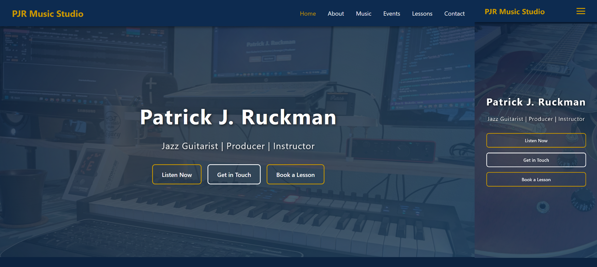

# Patrick J. Ruckman / PJR Music Studio Booking Site

**A professional studio management, event booking, and client onboarding platform.**

  

## Description

This is a high-conversion digital storefront and management tool for my professional music business. It’s designed to handle the "administrative bottleneck" of music education and music performance by providing a centralized location for student intake, service descriptions, contact management, and booking information. It has a streamlined, professional entry point for new clients or anyone else looking to get in touch.

## Why I Built It

I needed a central hub where students and bookers could go to get in touch with me, whether it is for one-on-one private lessons, group lessons which are run by me and hosted by my local park district, or booking for an individual or group performance.

In my experience as a **Program Director**, I saw how easily potential students can get lost with knowing how to progress their skills on their instruments, or how to connect with other local musicians. Drawing on **Behavioral Psychology**, I built this site with "low-friction" design principles—using clear call-to-action buttons and organized service tiers—to ensure the transition from a curious visitor to an enrolled student is as seamless as possible.

## Tech Stack

**Frontend:** Vanilla HTML/CSS  
**Architecture:** Modular HTML structure for easy updates to service offerings.  
**Forms/Logic:** Formspree integration for secure, reliable client data collection.  
**Design:** Custom CSS focused on brand identity and mobile-first responsiveness.  

## Project Status: Completed (v1.0)

- [x] **Done:** Developed a responsive, brand-aligned UI.  
- [x] **Done:** Integrated secure intake forms for lead generation.  
- [ ] **Up Next:** Update service-tier architecture for one-on-one lesson types.  
- [ ] **Up Next:** Integrating a live calendar API for real-time scheduling.  
- [ ] **Up Next:** Implementing integrated payment methods and automated schedule coordination.  

---
*Developed by Patrick Ruckman | Software Developer, Music Program Director, Guitarist* 
